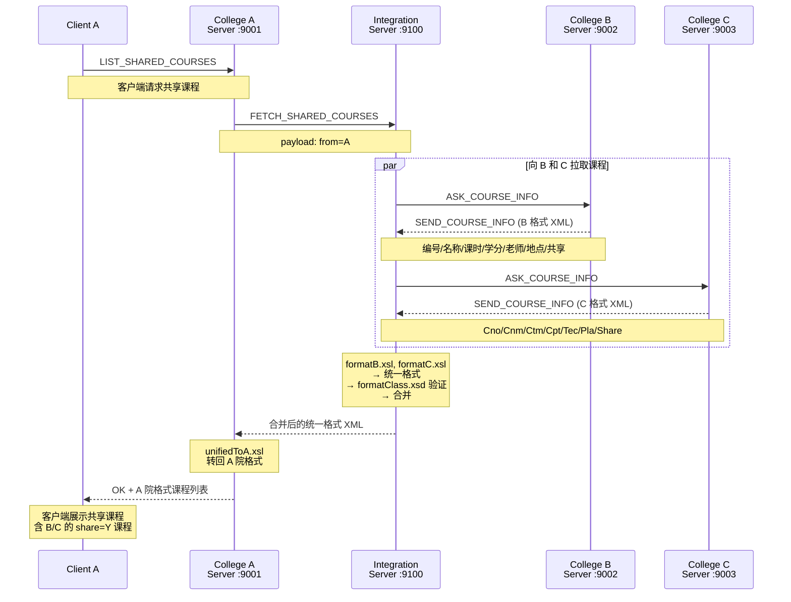
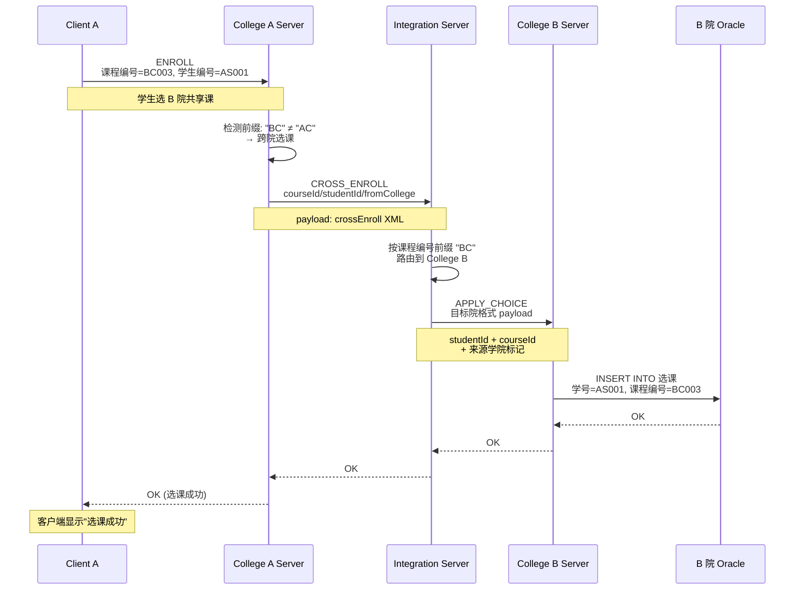
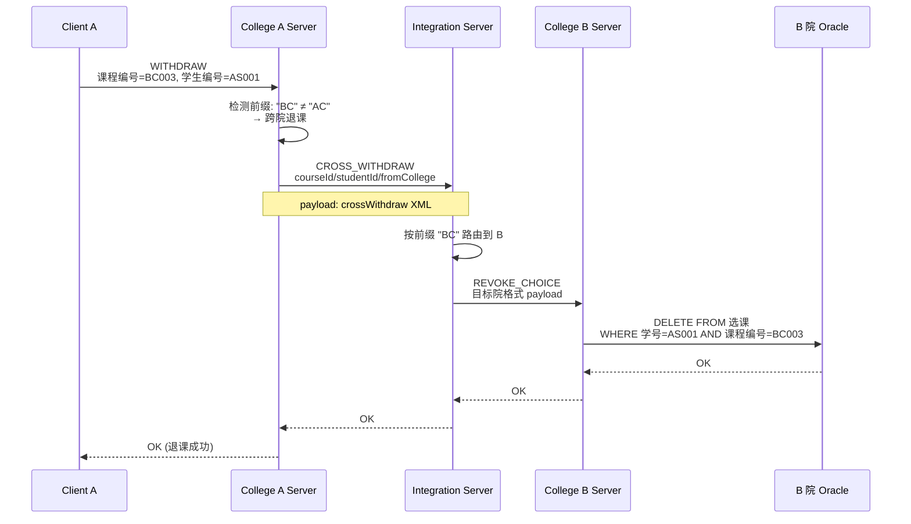
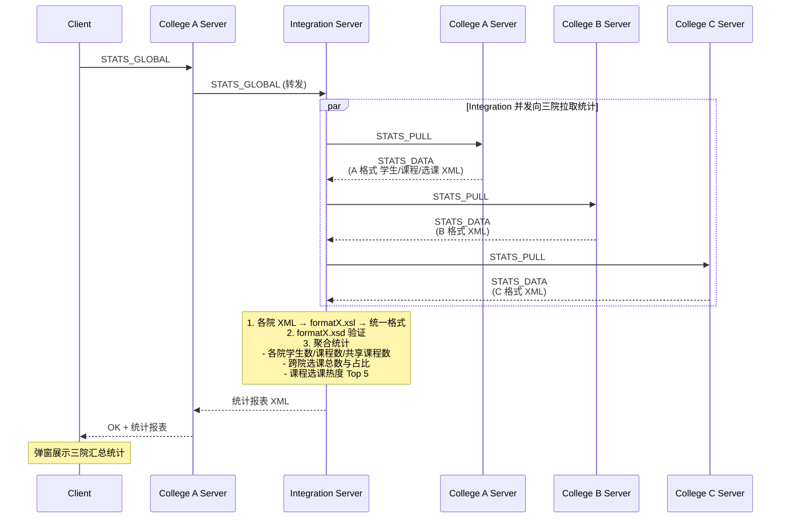
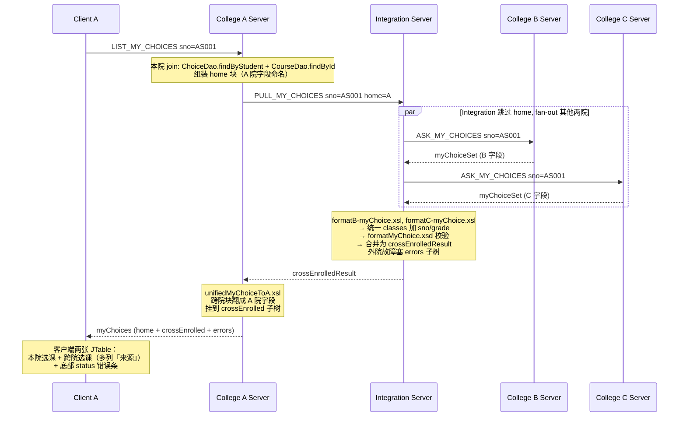

# 基于 XML 的异构数据集成 — 实验报告

**课程：** 数据库系统课程作业三  
**日期：** 2026-05-28  
**项目：** 三院异构 DBMS 教务系统的 XML 数据集成  

---

## 目录

1. [项目背景](#1-项目背景)
2. [系统架构](#2-系统架构)
3. [数据集成流程](#3-数据集成流程)
   - [3.1 课程共享流程](#31-课程共享流程)
   - [3.2 跨院选课流程](#32-跨院选课流程)
   - [3.3 跨院退课流程](#33-跨院退课流程)
   - [3.4 全局统计流程](#34-全局统计流程)
   - [3.5 「我的选课」聚合流程](#35-我的选课聚合流程)
4. [XML 技术应用](#4-xml-技术应用)
5. [异构数据库设计](#5-异构数据库设计)
6. [实验数据](#6-实验数据)
7. [测试结果](#7-测试结果)
8. [一致性分析与改进方向](#8-一致性分析与改进方向)

---

## 1. 项目背景

三个学院各自运行独立的教务管理系统，使用不同的 DBMS（SQL Server、Oracle、MySQL），数据库表结构和字段命名各异。现需通过新增集成服务器，实现三院间的课程共享、跨院选课、跨院退课和全局统计，所有数据交换以 XML 为载体。

**四个核心集成需求：**

1. 各院系独立教务系统（GUI 登录、本院课程查询、本院选课/退课）
2. 通过集成服务器实现课程共享与跨院选课
3. 集成服务器端统计全院学生、课程及选课信息
4. 集成环境下的退课流程

**附加需求：**

5. 学生「我的选课」视图：跨院聚合学生在所有学院的选课记录

---

## 2. 系统架构

```
                             SQL Server          Oracle            MySQL
                           ┌──────────┐    ┌──────────┐    ┌──────────┐
                           │ DB - A   │    │ DB - B   │    │ DB - C   │
                           └────▲─────┘    └────▲─────┘    └────▲─────┘
                                │ JDBC           │ JDBC           │ JDBC
┌──────────┐  Socket  ┌────────┴──────┐  ┌──────┴────────┐  ┌──────┴────────┐
│ Client A │◄────────▶│ College A     │  │ College B     │  │ College C     │
└──────────┘ 本院命令  │ Server :9001  │  │ Server :9002  │  │ Server :9003  │
                       └───────┬──────┘  └───────┬───────┘  └───────┬───────┘
                               │                  │                   │
                               │    Socket + XML   │                   │
                               └──────────┬────────┴──────────┬────────┘
                                          │                   │
                                   ┌──────┴───────────────────┴──────┐
                                   │      Integration Server         │
                                   │           :9100                 │
                                   │  XSL 转换 + XSD 验证 + 聚合     │
                                   └─────────────────────────────────┘
```

**关键设计约束：**
- 客户端只与本院 Server 通信，不直接访问数据库或其他院 Server
- 两个 College Server 之间从不直接通信——所有跨院请求经过 Integration Server（星型拓扑）
- Integration Server 无持久化业务数据，仅做路由、转换和聚合

**5 个进程：** Integration Server + College A Server + College B Server + College C Server + 客户端

---

## 3. 数据集成流程

### 3.1 课程共享流程

A 院学生请求查看所有可共享课程时，A Server 委托 Integration Server 向 B、C 拉取课程数据，经 XSL 格式转换合并后返回。



**关键技术点：**
- Integration Server 用 `formatB.xsl` / `formatC.xsl` 将 B/C 原生 XML → 统一 `<classes>` 格式
- 统一格式经 `formatClass.xsd` 验证后才合并，保证数据完整性
- A Server 收统一格式后用 `unifiedToA.xsl` 转为 A 院字段名 → 客户端无需感知格式差异

---

### 3.2 跨院选课流程

A 院学生选 B 院课程时，A Server 检测课程编号前缀（`BC` ≠ `AC`），自动将选课请求转发给 Integration Server，经格式转换后抵达 B 院完成写入。



**一致性策略：** B 院是选课记录的"真相源"。选课信息仅写入目标院（B）的选课表，不反向写入源院（A）。这种设计避免了双写带来的不一致风险。

**路由判断逻辑：** 通过课程编号前缀（`AC`/`BC`/`CC`）判断课程归属，无需中心注册表，各院 Server 独立决策。

---

### 3.3 跨院退课流程

学生退选跨院课程时，先删目标院（真相源）的选课记录，成功后再通知源院。遵循"真相源优先"原则。



**关键设计：** 跨院退课必须先删 B 的，再处理 A。如果先删 A 的记录而 B 的删除失败，会出现"A 显示已退但 B 仍然有效"的数据不一致。

---

### 3.4 全局统计流程

管理员发起全局统计，Integration Server 并行向三院拉取数据快照，转换为统一格式后聚合生成报表。



**统计维度：**
- 全局汇总：学生总数、课程总数、共享课程总数、跨院选课数与占比
- 分院校明细：各院的学生数、课程数、共享课程数
- 热门课程排行：按选课人数降序 Top 5

---

### 3.5 「我的选课」聚合流程

学生在客户端点「我的选课」，本院 Server 既要返回本院选课，也要从 Integration Server fan-out 拉外院选课，合并展示。



**关键设计点：**
- **本院数据是底线**：任何外院故障不影响本院块的呈现；`<errors>` 子树标记哪个院走损
- **XSL 翻译在 home server 端做**：客户端零 XSL 依赖，与共享课程流水线一致（client 不依赖 college 模块的 classpath）
- **路由排除 home 院**：`PullMyChoicesHandler` 用 `home` 属性决定向哪两院 fan-out，避免重复查询本院

---

## 4. XML 技术应用

### 4.1 XSD 验证体系

系统在 6 个数据交换边界实施 XSD 验证：

| 关卡 | 位置 | 验证内容 |
|------|------|---------|
| 1 | College Server 出口 | 本院 XSD（确保发出的 XML 合法） |
| 2 | Integration Server 入口 | 本院 XSD（确保收到的格式未损坏） |
| 3 | Integration Server 转换 | formatX.xsl 转换后，用 `formatClass.xsd` 验证统一格式 |
| 4 | Integration Server 出口 | 目标院 XSD 验证 |
| 5 | 目标 College Server 入口 | 再次验证（防御性） |
| 6 | XSL 转换前后对照 | 日志存档 `logs/transform/` |

### 4.2 XSL 转换文件清单

| 文件 | 角色 | 部署位置 |
|------|------|---------|
| `formatA.xsl` | A 院原生 → 统一格式（共享课聚合） | integration |
| `formatB.xsl` | B 院原生 → 统一格式（共享课聚合） | integration |
| `formatC.xsl` | C 院原生 → 统一格式（共享课聚合） | integration |
| `formatA-myChoice.xsl` | A 院 `<myChoiceSet>` → 统一 `<classes>`+sno+grade | integration |
| `formatB-myChoice.xsl` | B 院 `<myChoiceSet>` → 同上 | integration |
| `formatC-myChoice.xsl` | C 院 `<myChoiceSet>` → 同上 | integration |
| `unifiedToA.xsl` | 统一格式 → A 院格式（共享课展示） | college-a |
| `unifiedToB.xsl` | 统一格式 → B 院格式 | college-b |
| `unifiedToC.xsl` | 统一格式 → C 院格式 | college-c |
| `unifiedMyChoiceToA.xsl` | 统一 → A 院（跨院选课展示，含来源/学号/成绩） | college-a |
| `unifiedMyChoiceToB.xsl` | 同上 | college-b |
| `unifiedMyChoiceToC.xsl` | 同上 | college-c |
| `identity.xsl` | 身份变换（回归测试） | integration |

### 4.3 通信协议帧格式

```
<COMMAND> <REQUEST_ID>\n
Content-Length: <字节数>\n
\n
<UTF-8 XML 负载，恰好 N 字节>
```

通过 `Content-Length` 头解决 Socket 流的粘包/截断问题，保证消息边界。

---

## 5. 异构数据库设计

三院数据库结构差异（设计上必须保留，体现异构特点）：

| 维度 | 学院 A (SQL Server) | 学院 B (Oracle) | 学院 C (MySQL) |
|------|---------------------|-----------------|----------------|
| 课程表主键 | `课程编号 varchar(8)` | `编号 varchar2(5)` | `Cno char(4)` |
| 课程字段风格 | 中文长名（课程名称/授课老师/授课地点） | 中文短名（名称/老师/地点） | 英文缩写（Cnm/Tec/Pla） |
| 学生表字段 | 学号/姓名/性别/院系/关联账户 | 学号/姓名/性别/专业/密码 | Sno/Snm/Sex/Sde/Pwd |
| 账户认证方式 | `权限 char(4)`（stu/adm） | `级别 number(2)`（1=stu, 5=adm） | 无角色字段（统一 stu） |
| 选课表约束 | UNIQUE (课程编号, 学生编号) | 无唯一约束 | UNIQUE KEY (Sno, Cno) |
| 选课表来源列 | `来源 char(1) DEFAULT 'A'` | `来源 char(1) DEFAULT 'B'` | `Org char(1) DEFAULT 'C'` |

> 三院 `选课` 表对学生表都没有 FK：跨院选课时学生不在本院学生表里，FK 会破坏跨院流。请求方学院信息靠 `来源`/`Org` 列保留。

**三院数据规模：** 各 50 学生 / 10 课程（含 4 门共享） / 每生 5 选课（共 250 选课记录）。学号/课程编号前缀互不重叠（A: AS/AC, B: BS/BC, C: CS/CC）。

---

## 6. 实验数据

### 种子数据示例

**A 院（SQL Server）：**
- 学生：AS001 张伟 男 计算机 … AS050 王芳 女 计算机
- 课程：AC001 数据库原理 (共享) … AC010 数据结构
- 选课：每生 5 门，共 250 条

**B 院（Oracle）：**
- 学生：BS001 张敏 男 计算机 … BS050 赵强 女 计算机
- 课程：BC001 数据库原理 (共享) … BC010 数据结构
- 选课：每生 5 门，共 250 条

**C 院（MySQL）：**
- 学生：CS001 赵敏 M 计算机 … CS050 钱军 M 计算机
- 课程：CC01 Database (共享) … CC10 DataStructure
- 选课：每生 5 门，共 250 条

> 课程内容有部分重叠（如"数据库原理"在三院都存在但编号/字段名不同），用于演示"共享但保留本院版本"。

---

## 7. 测试结果

```text
[INFO] Tests run: 25, Failures: 0, Errors: 0, Skipped: 0    (common)
[INFO] Tests run: 33, Failures: 0, Errors: 0, Skipped: 0    (college-a)
[INFO] Tests run: 32, Failures: 0, Errors: 0, Skipped: 0    (college-b)
[INFO] Tests run: 21, Failures: 0, Errors: 0, Skipped: 0    (college-c)
[INFO] Tests run: 23, Failures: 0, Errors: 0, Skipped: 0    (integration)
[INFO] Tests run:  3, Failures: 0, Errors: 0, Skipped: 0    (client)
[INFO] Tests run:  9, Failures: 0, Errors: 0, Skipped: 0    (seed-data)
─────────────────────────────────────────────────────────
[INFO] Tests run: 146, Failures: 0, Errors: 0, Skipped: 0
[INFO] BUILD SUCCESS
```

测试覆盖：协议帧编解码、XML 读写、XSD 验证（`formatClass.xsd` / `formatMyChoice.xsd` 等）、XSL 转换（13 个 XSL 全覆盖）、DAO 集成测试（真实 DB）、Handler 单元测试、跨院路由模拟测试、`PullMyChoicesHandler` fan-out + 错误聚合测试、三院 `ListMyChoicesHandler` ServerSocket 模拟集成测试。

---

## 8. 一致性分析与改进方向

### 当前策略：真相源 + 补偿

- **跨院选课：** 目标院的选课表是唯一真相源，源院不存副本；选课表加 `来源`/`Org` 列标记请求方学院
- **跨院退课：** 先删目标院 → 成功后才返回给客户端
- **「我的选课」**：通过 fan-out 三院聚合查询解决了"无源院反向引用"带来的可达性问题
- **无 2PC：** 不实现两阶段提交，以简化实现

### 已知限制

1. 三院 `选课` 表对学生表**没有** FK：跨院学生不属于本院学生表，FK 会破坏跨院流。请求方学院信息靠 `来源`/`Org` 列保留
2. Integration Server 宕机时，客户端只能进行本院操作（降级）；「我的选课」会返回本院块 + `<errors college="*">` 提示外院不可达
3. 没有事务/2PC：`APPLY_CHOICE` 失败时源端不会回滚；目前架构下源端无写状态可回滚，自然一致

### 改进方向

- 引入后台定时同步任务，处理补偿失败后的残留数据
- 为跨院选课增加"课程容量校验"环节
- 「我的选课」加客户端缓存，避免短时间内重复跨院 fan-out

---

**交付物清单：**

| 交付物 | 路径 |
|--------|------|
| Maven 多模块源码 | 项目根目录 |
| 建库脚本 + 种子数据 | `college-{a,b,c}/src/main/resources/sql/` |
| XML Schema (4 个统一 XSD + 各院本地 XSD) | `common/src/main/resources/schema/` + 各院 `xml/` |
| XSL 转换文件 (13 个) | `integration/src/main/resources/xsl/` (7) + 各院 `src/main/resources/xsl/` (6) |
| 启动脚本 | `scripts/start-all.sh` |
| 演示脚本 | `docs/demo.md` |
| 设计文档 | `docs/superpowers/specs/` |
| 实现计划 | `docs/superpowers/plans/` |
| README | `README.md` |
